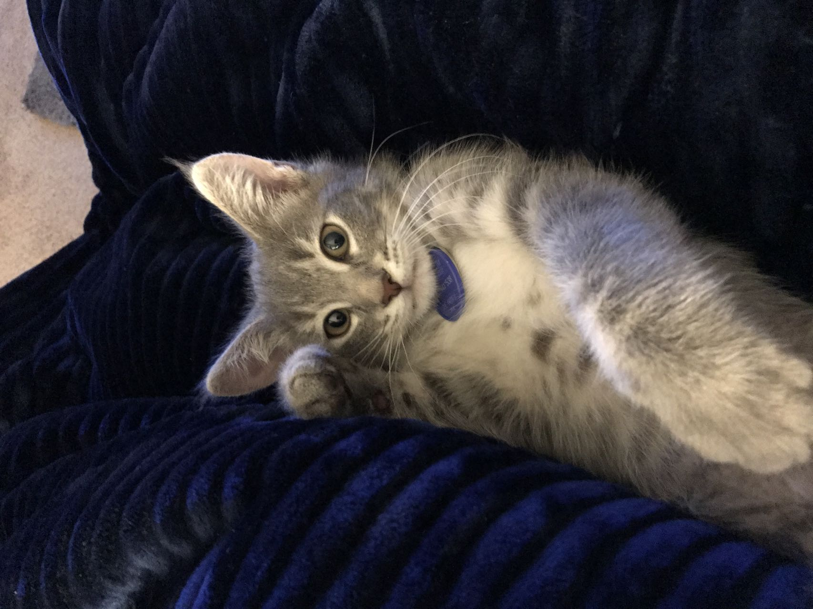

# Yalong Tian
  *3rd year transfer student majoring in Computer Science*


#### My Background

Hi! I'm Yalong. I'm super excited and nervous since this is my first term taking classes in ucsd campus.

I learned a lot of different programming languages such as C, C++, java, python, html and css, and I done tons of PAs before. However, I never making a application or APP before, so I hope I can do some of these things during this class.

things I want to learn from this class:
- [ ] How to work as a group
- [ ] How to apply my coding knowledge in the real world
- [ ] What is software engineering? More software or engineering?

#### About me
I am interested in quantitative trading, so when I have free time, I will learn some trading knowledge and build some trading bots to apply both my programming knowledges and trading knowledges.

my hobbies:
- gaming
- trading
- cooking

My favorite classes in UCSD:
1. CSE 100
2. CSE 30
3. CSE 140

favorite quote:
> Risk comes from not knowing what you’re doing. -Warren Buffett

website help me find a job:
[leetcode](https://leetcode.com/)

First code I learned:
```
#include <stdio.h>
int main() {
   printf("Hello, World!");
   return 0;
}
```

My cat:


[Link to README](README.md)